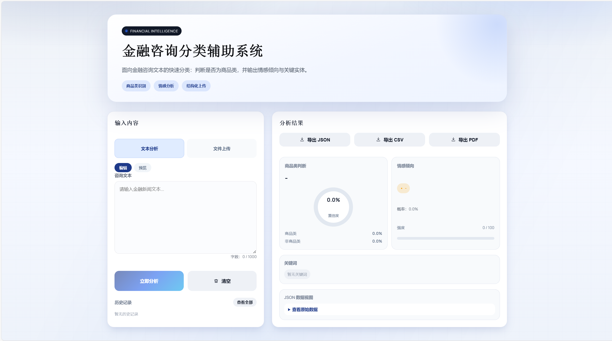
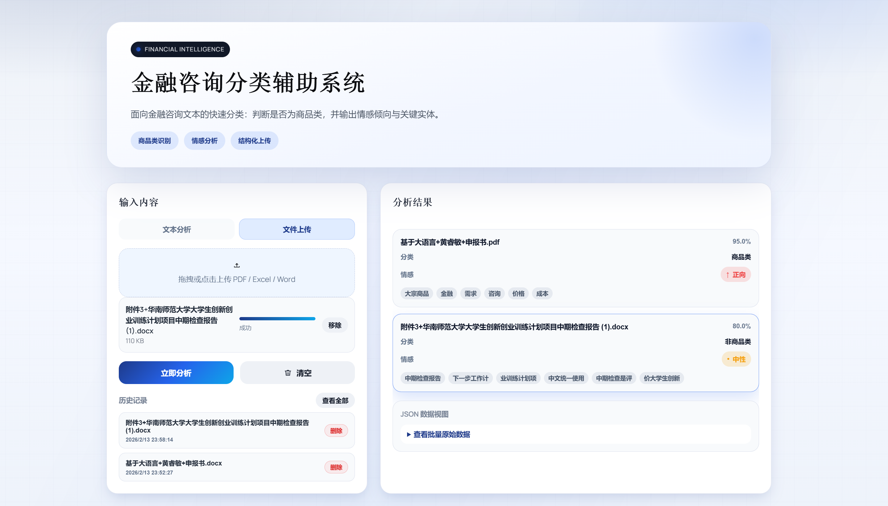
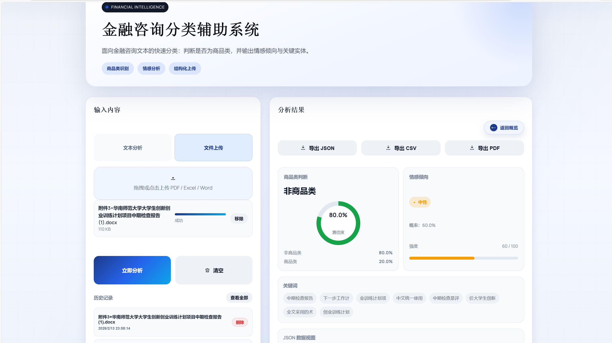

# 金融咨询分类辅助系统

本项目采用 **React 静态前端 + FastAPI 后端** 架构，面向金融文本分类与情感分析场景。
模型路线统一为 **Qwen2.5-Instruct + LoRA 多标签分类**；当前仓库默认使用规则基线完成接口联调与页面演示，待 GPU / 推理资源满足后再启用 Qwen2.5 + LoRA 在线推理。

## 页面功能（已对照 PRD 更新）

- **双栏 Dashboard 布局**：左侧输入控制区（40%），右侧结果可视化区（60%），移动端自动折叠单栏
- **文本分析模式**：支持 Markdown 预览、字数统计（限制 1000 字）、一键清空、分析 Loading
- **文件上传模式**：支持拖拽/多选上传 `pdf/xlsx/xls/docx`，显示上传列表、进度与状态
- **Excel 预览**：若上传 Excel，前端展示前 5 行数据预览
- **结果可视化**：商品类置信度仪表盘、情感强度条、关键词 Tag 云、多标签列表
- **JSON 原始数据视图**：折叠面板查看后端原始返回，便于调试
- **交互体验**：骨架屏、Toast 错误提示
- **历史记录**：LocalStorage 保存最近 8 条分析（支持删除/清空）
- **报告导出**：支持 JSON / CSV / PDF 导出
- **批量结果概览**：分组卡片 + JSON 视图，点击卡片查看详情，支持收起回到概览

## 目录结构

- `frontend/`  React (Vite)
  - `frontend/src/App.jsx`  页面与交互逻辑
  - `frontend/src/App.css`  页面样式
  - `frontend/src/index.css`  全局字体与背景
  - `frontend/vite.config.js`  代理 `/api` 到后端
- `backend/`  FastAPI
  - `backend/app.py`  接口与推理逻辑（含模型扩展入口）
  - `backend/llm_model.py`  Qwen2.5-Instruct + LoRA 推理适配
  - `backend/LLM/`  LoRA 训练、评估与数据处理脚本
  - `backend/requirements.txt`  后端依赖
- `README.md`  项目说明

## 启动方式

### 1) 启动后端

```bash
cd backend
python -m pip install -r requirements.txt
python -m uvicorn app:app --host 127.0.0.1 --port 8000
```

> 说明：Excel 解析依赖 `pandas/openpyxl/xlrd`，已加入 `requirements.txt`。

### 2) 启动前端

```bash
cd frontend
npm install
npm run dev
```

浏览器访问 `http://localhost:5173`。




## 接口说明（PRD 对齐）

### `POST /api/v1/analyze/text`

**Request (JSON)**
```json
{
  "text": "受美联储加息影响，今日国际黄金价格下跌。",
  "model_version": "qwen2.5-instruct-lora"
}
```

**Response (JSON)**
```json
{
  "classification": {"label": "商品类", "confidence": 0.7999999999999999},
  "sentiment": {"label": "负向", "score": 90.0},
  "labels": ["国际", "市场", "金属", "政策", "消极"],
  "keywords": ["价格", "黄金"],
  "product_label": {"商品类": 0.7999999999999999, "非商品类": 0.20000000000000007},
  "sentiment_label": {"正向": 0.0, "中性": 0.09999999999999998, "负向": 0.9},
  "preview": null,
  "debug": {
    "product_hits": 2,
    "finance_hits": 1,
    "sentiment_pos": 0,
    "sentiment_neg": 1,
    "labels_source": "rule_based",
    "model_mode": "rule_based",
    "text_length": 20,
    "model_loaded": false
  }
}
```

### `POST /api/v1/analyze/file`

**Content-Type:** `multipart/form-data`
- `file`: 仅支持 `pdf/xlsx/xls/docx`
- `model_version`: 可选

**Response:** 同上，若为 Excel 会包含 `preview`（前 5 行）。

### 兼容旧接口

- `POST /api/predict`：保留旧版接口，仍支持 `text` + `file` 组合。

## 模型方案（重点）

本项目的模型路线已经统一为 **Qwen2.5-Instruct + LoRA 多标签分类**，不再把 BERT 或其他通用分类模型作为主路线说明。

- `backend/LLM/`：LoRA 训练、评估、数据处理脚本
- `backend/llm_model.py`：Qwen2.5-Instruct + LoRA 推理适配
- `backend/app.py`：统一对外 API 与规则基线 / LoRA 推理切换入口

### 当前运行状态

- 当前仓库默认使用规则基线返回结果，方便前后端联调与轻量演示
- `Qwen2.5-Instruct + LoRA` 推理代码已集成，但默认关闭
- 关闭原因是本地在线推理需要较高 GPU 显存与运行资源
- 资源条件满足后，可在 `backend/llm_model.py` 中启用 LoRA 推理逻辑

### 当前接口与模型关系

- 接口层仍统一返回 `classification / sentiment / product_label / sentiment_label / keywords`
- 当启用 Qwen2.5 + LoRA 推理后，后端会把多标签输出整理为前端当前可消费的结构
- 当前 `model_version` 主要作为版本标识，不影响默认规则基线流程

## Pending Items（模型侧）

1. **Qwen2.5-Instruct + LoRA 在线推理启用**
- 需要在具备足够 GPU 资源的环境中启用推理加载
- 需要补齐生产环境的推理配置与部署方式

2. **多标签输出与前端展示对齐**
- 需要明确多标签结果如何映射到当前前端卡片结构
- 若前端后续直接展示完整标签集合，可进一步扩展返回字段

3. **情感输出规范化**
- 需要明确情感标签集合与顺序（正/中/负）
- 需要给出 score 的含义范围（0-1 or 0-100）

4. **实体高亮（可选高级功能）**
- 若希望在原文中高亮实体，模型需返回 span 位置信息

### Impact on UI
- **未启用 LoRA 在线推理时**：
  - 当前结果主要来自规则基线
  - 多标签语义能力与上下文理解能力有限
- **多标签映射未完全打通时**：
  - 前端只能展示整理后的主标签与概率分布
  - 完整标签集合需要额外字段或新的展示组件
- **缺少情感规范时**：
  - 情感强度条可能显示不准确
- **无实体 span 时**：
  - 仅能展示关键词 Tag，无法在原文中高亮

## 导出说明

- JSON/CSV 为标准文本导出
- PDF 由前端 `jsPDF` 生成，当前为英文模板；如需中文字体，需要额外嵌入字体文件

## 常见问题

- **后端访问 `/` 返回 404**：正常，后端只提供 API。
- **前端接口报错**：确认后端已启动，且 `http://127.0.0.1:8000` 可访问。
- **PDF/Excel/Word 无法解析**：确认后端已安装 `pypdf` / `pandas` / `openpyxl` / `xlrd` / `python-docx`。
